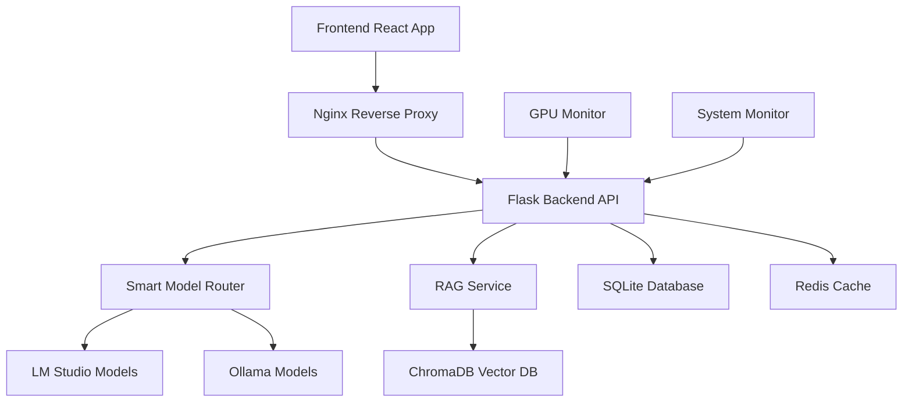

<div align="center">

# ShadowRealms AI


### The Ultimate AI-Powered Tabletop RPG Experience

[](https://github.com/Somnius/shadowrealms-ai)
[](https://github.com/Somnius/shadowrealms-ai)
[](https://github.com/Somnius/shadowrealms-ai)
[](https://github.com/Somnius/shadowrealms-ai)
[](https://github.com/Somnius/shadowrealms-ai)
[](LICENSE)

---

## Enter a World Where AI Becomes Your Dungeon Master

*Experience the future of tabletop RPG gaming with intelligent AI assistance, persistent world memory, and seamless multi-language support.*

---

</div>

## What is ShadowRealms AI?

ShadowRealms AI is a revolutionary platform that transforms traditional tabletop RPG gaming by integrating advanced AI technology. Our system acts as an intelligent Dungeon Master, providing dynamic storytelling, character development, and world-building assistance while maintaining complete campaign continuity through advanced memory systems.

### Key Features

<div align="center">

| **AI Dungeon Master** | **Persistent Worlds** | **Smart Dice System** |
|:---:|:---:|:---:|
| Intelligent NPC behavior and dynamic storytelling | ChromaDB-powered memory for campaign continuity | Automated dice rolling with context awareness |

| **Multi-Language** | **Real-time Performance** | **Secure & Private** |
|:---:|:---:|:---:|
| Global accessibility with translation pipelines | Optimized for 5-10s responses, 30-60s for complex tasks | Local AI processing, no data leaves your system |

</div>

---

## 🎬 Demo Video

See ShadowRealms AI in action:

<div align="center">

[](https://www.youtube.com/watch?v=9RGGb-F5Y2M)

**[▶️ Watch the Full Demo on YouTube](https://www.youtube.com/watch?v=9RGGb-F5Y2M)**

*Watch this video to see the login system, gothic theme, campaign management, and admin panel in action!*

> **Version 0.7.10 Preview:** This demo showcases the frontend interface in its current state. Please note that not all features are fully functional yet—this is a first look at the user interface and design direction of ShadowRealms AI.

</div>

---

## Documentation

For comprehensive documentation, detailed setup instructions, and complete feature overview, please refer to our complete documentation:

**[View Complete Documentation](https://github.com/Somnius/shadowrealms-ai/blob/main/SHADOWREALMS_AI_COMPLETE.md)**

### Additional Resources

- **[Testing Guide](frontend/TESTING.md)** - Comprehensive testing documentation
- **[Contributing Guidelines](docs/CONTRIBUTING.md)** - How to contribute to the project
- **[Changelog](docs/CHANGELOG.md)** - Detailed version history and updates
- **[Docker Setup Guide](docs/DOCKER_ENV_SETUP.md)** - Environment configuration
- **[Books Sync Guide](books/README.md)** - World of Darkness books synchronization
- **[Test Suite Guide](tests/README.md)** - Comprehensive test documentation
- **[Documentation Index](docs/README.md)** - Complete documentation index

---

## Quick Start

<div align="center">

### One Command to Rule Them All

```bash
git clone https://github.com/Somnius/shadowrealms-ai.git
cd shadowrealms-ai
docker-compose up -d
```

**Access Points:**
- **Frontend**: http://localhost:3000
- **Backend API**: http://localhost:5000
- **ChromaDB**: http://localhost:8000

</div>

---

## Technology Stack

<div align="center">

### Backend & Infrastructure


### AI & Machine Learning


### Frontend & UI


### Development & Monitoring


</div>

---

## Current Development Status

<div align="center">

### Version 0.7.10 - Logo & Asset Optimization ⚡

**Latest Updates:**
- ⚡ **Logo Optimization**: Reduced logo assets from 1.6MB to 116KB (93% reduction)
- 🖼️ **Multiple Resolutions**: Created dedicated sizes for login (300x300), header (80x80), and favicons
- 🚀 **Performance Boost**: Faster page loads, reduced bandwidth usage, better mobile experience
- 🎨 **Enhanced Favicon Support**: Multi-format favicon.ico + PNG favicons (16x16, 32x32, 64x64)
- 📱 **iOS Support**: Apple touch icon for better home screen bookmarks

### Version 0.7.9 - Project Structure Organization 📁

**Latest Updates:**
- 📁 **Scripts Directory Created**: Organized all 8 utility scripts into `scripts/` directory
- 📚 **Documentation Updated**: Fixed all script path references across 10 documentation files
- 🗂️ **Test Results Moved**: Relocated `test_results.log` to `tests/` directory
- ✅ **Backup Directories Protected**: Verified `backup/` and `backups/` properly ignored

### Version 0.7.8 - Footer Version Display Fix 🔧

**Latest Updates:**
- 🔧 **Footer Version Fixed**: Corrected API path from `/api/api/version` to `/api/version`
- ✅ **Version Display Working**: Footer now correctly shows application version from backend

### Version 0.7.7 - PostgreSQL Migration Fixes & Remote Access 🗄️🌐

**Latest Updates:**
- 🗄️ **PostgreSQL Compatibility**: Fixed dictionary row access bugs across all routes after migration from SQLite
- 🔧 **Boolean SQL Fixes**: Updated all queries from SQLite `is_active = 1` to PostgreSQL `is_active = TRUE`
- 👥 **Admin Panel Fixed**: User management now displays correctly with proper datetime handling
- 📍 **Location System Fixed**: Campaign location queries now work with PostgreSQL GROUP BY requirements
- 🤖 **AI Model Configuration**: Smart router now dynamically loads model from `LM_STUDIO_MODEL` env var
- 🌐 **Remote Network Access**: Configured hybrid Docker networking for LAN access (10.0.0.x)
- 🔌 **ChromaDB Resilience**: Added retry logic (10 attempts) for reliable service connection
- 🚪 **Nginx Routing Fixed**: API proxy now preserves `/api` prefix for correct endpoint routing

### Version 0.7.6 - Message Persistence & API Verification ✅💬

**Latest Updates:**
- 💬 **Message Persistence**: Chat messages now properly save to database and persist across location changes
- 🔍 **API Path Verification**: Complete frontend-backend URL path audit and corrections
- 🎯 **Chat Input Focus**: Fixed focus loss after sending messages in chat
- 📡 **ChromaDB API Update**: Updated health checks to use ChromaDB v2 API endpoints
- 🏷️ **Dynamic Versioning**: Footer version now dynamically loads from backend `.env`
- 🔧 **URL Standardization**: All message endpoints now follow consistent `/api/campaigns/{id}/locations/{id}` pattern

### Version 0.7.5 - AI Health Checks & Security Hardening 🛡️🔍

**Latest Updates:**
- 🏥 **LM-Studio/Ollama Health Checks**: Automatic service validation before AI operations
- 🔒 **Sensitive Data Protection**: Book source URLs moved to `.env` (not version controlled)
- 👁️ **OOC Monitoring System**: AI-powered detection of in-character content in OOC rooms with 3-strike ban system
- 🧹 **AI Memory Cleanup**: Automatic purging of deleted location/campaign data from ChromaDB
- 🔧 **API Endpoint Audit**: Complete validation and fixes for frontend-backend routing
- 📊 **Quality Over Speed**: Comprehensive health checks prevent operations with missing services

### Version 0.7.0 - Phase 3B: Security & Testing Foundation 🔒🧪

**Last Updated**: `2025-10-24`
**Progress**: `Security System & Test Suite - Foundation for Phase 3B`

**⚠️ Current Reality Check:**
- ✅ **Working**: Login/Register, Admin Panel, Gothic Theme, Campaign Editing, Mobile UI, Custom Dialogs, **Security System**
- ✅ **New**: Security utilities (400+ lines), Test suite (630+ lines), Input sanitization, Rate limiting
- 🚧 **In Progress**: Phase 3B Week 1 - Location System, Character System, Real-time Chat
- 📋 **Planned**: WebSocket chat, AI integration, Full character management

</div>

### Phase 2 Complete ✅

<div align="center">

| **Foundation** | **AI Services** | **Web Interface** |
|:---:|:---:|:---:|
| Complete Docker environment with all 6 services stable | Both LM Studio (3 models) and Ollama (1 model) fully working | React application serving through nginx proxy |
| Backend API with authentication and RAG integration | ChromaDB vector memory system fully functional | Production-ready reverse proxy configuration |
| SQLite schema with ChromaDB fully operational | Smart Model Router for intelligent model selection | JWT-based user management with role-based access |
| Campaign Management API | Memory Search & Context Retrieval | RAG-Powered AI Responses |
| Vector Embeddings | Persistent AI Memory | Context-Aware Generation |
| API Response Consistency | Character Creation Schema | 100% User Experience Tests |
| Rule Book Integration | WoD Books Processing | PDF Parser + RAG Import |
| Invite System | Quick Import Tools | Integration Testing Suite |

</div>

### Phase 3A Status 🚧 (v0.6.0 - Frontend Foundation)

<div align="center">

| **✅ WORKING NOW** | **🚧 UI EXISTS (Not Wired)** | **📋 TODO** |
|:---:|:---:|:---:|
| **Login/Register** - Fully functional | Character creation form (no backend) | Character system wiring |
| **Admin Panel** - User management works | Location chat UI (static) | WebSocket real-time chat |
| **Invite System** - Secure registration | AI chat interface (placeholder) | LM Studio integration |
| **Gothic Theme** - Immersive atmosphere | Rule book search UI (no data) | ChromaDB RAG hookup |
| **Campaign Editing** - Name/desc updates | Character selection (no chars) | Full gameplay loop |
| Campaign list with themes | Message history display (mock) | Session management |
| Role-based access (admin/player) | OOC chat room (not live) | Campaign deletion |
| JWT authentication | Campaign details page | NPC/Character management |
| User bans (temp/permanent) | Location management UI | Dice rolling system |
| Password reset by admin | Game-specific emojis/colors | Advanced features |
| **👑 Admin Panel** (v0.6.1) | **User Moderation** (v0.6.1) | **Character Management** (v0.6.1) |
| Admin-only panel UI (720 lines) | Temporary & permanent bans | Convert character to NPC |
| User table with status | Ban duration tracking | Kill character with death types |
| Edit user profiles | Password reset by admin | Character moderation log |
| Moderation audit log | Auto-expiring temp bans | Soft/Mid/Horrible death options |
| Refactored architecture | All actions logged | Admin-controlled NPCs |
| **🦇 Gothic Horror Theme** (v0.6.2) | **Theme-Specific Effects** (v0.6.2) | **Immersive Atmosphere** (v0.6.2) |
| Complete CSS theme (352 lines) | Vampire: Dripping blood | Gothic fonts (Cinzel/Crimson Text) |
| GothicBox components (194 lines) | Mage: Magic sparkles | Clean login/register screens |
| Gothic Showcase (546 lines) | Werewolf: Bite marks | Campaign-aware theming |
| Dark fantasy aesthetics | Theme auto-switches by game | Larger logo with glow |
| GPU-accelerated animations | Effects only when appropriate | No emojis on buttons |
| **📝 Campaign Editing** (v0.6.3) | **Game System Themes** (v0.6.3) | **Enhanced UI** (v0.6.3) |
| Edit campaign names (inline) | 🩸 Vampire - Blood Red | Click-to-edit interface |
| Edit descriptions (textarea) | ✨ Mage - Mystic Purple | Game-specific emojis |
| Permission checks (creator/admin) | 🐺 Werewolf - Amber Gold | Color-coded campaign cards |
| Real-time UI updates | 🧚 Changeling - Fae Green | Save/cancel buttons |
| Backend PUT endpoint working | 🏹 Hunter - Silver | Instant save feedback |
| **📱 Responsive Design** (v0.6.4) | **Navigation Fixes** (v0.6.4) | **Mobile Optimization** (v0.6.4) |
| Full mobile support (315 lines CSS) | Browser back button fixed | Touch-friendly UI (44px targets) |
| Collapsible sidebars on mobile | Exit confirmation dialogs | Viewport meta tag configured |
| Mobile-first breakpoints | Proper navigation history | Safe area insets (notches) |
| Tablet & desktop layouts | Character exit warnings | Hamburger menu navigation |
| Responsive chat interface | Page state preservation | Swipeable panels |
| **🎨 UI/UX Polish** (v0.6.5) | **Custom Dialogs** (v0.6.5) | **In-App Docs** (v0.6.5) |
| Custom ConfirmDialog (140 lines) | Cannot be disabled by browser | README modal (306 lines) |
| Gothic-themed confirmations | Matches dark fantasy theme | Markdown parser built-in |
| Touch-friendly 44px buttons | Keyboard accessible (auto-focus) | Backend API endpoint |
| Footer component (182 lines) | Smooth fade-in animations | Docker volume mount |
| Version info & links | Blood-red border with glow | In-app documentation viewer |

</div>

### Documentation Reorganization ✅

<div align="center">

| **docs/ Directory** | **11 Files** | **3,701 Lines** |
|:---:|:---:|:---:|
| Complete documentation index | Version history (CHANGELOG.md) | Contribution guidelines |
| Docker setup guide | GitHub collaboration guide | Phase completion reports |
| Frontend/Backend audit | System status reports | Manual testing guides |
| Professional structure | Cleaner project root | Easy navigation |

</div>

---

## Development Roadmap

<div align="center">

### Phase 3B - Enhanced Frontend Features (NEXT) 🎯

| **Real-Time Features** | **Advanced UI/UX** | **Mobile Experience** |
|:---:|:---:|:---:|
| WebSocket integration | Advanced character sheet builder | Mobile-responsive design |
| Live player status updates | Drag-and-drop dice rolling | Touch-optimized controls |
| Instant notifications | Combat tracker interface | Progressive Web App (PWA) |
| Real-time message delivery | Inventory management UI | Offline capabilities |
| Typing indicators | Quest tracking system | Mobile navigation |

### Phase 4 - RPG Mechanics Integration

| **White Wolf Character System** | **Narrative Combat** | **World Building with Admin Control** |
|:---:|:---:|:---:|
| Advanced WoD character sheets | Turn-based narrative combat | Location & NPC management |
| d10 dice pools with difficulty | XP cost AI assistance | Admin verification system |
| Character progression tracking | Environmental factors | Procedural generation with approval |
| Skill checks and modifiers | Initiative system | World state management |

### Phase 5 - Advanced Features

| **Multiplayer Support** | **Advanced AI** | **Content Creation** |
|:---:|:---:|:---:|
| Real-time collaboration | Enhanced NPC behavior | Custom rule system support |
| Session management | Dynamic world events | Community content sharing |
| Voice integration | Advanced storytelling | Mod support |
| Video chat for remote play | Multi-language support | Campaign templates |

</div>

---

## Architecture Overview

<div align="center">



</div>

---

## Game Systems Supported

<div align="center">

| **D&D 5e** | **White Wolf** | **Custom Systems** |
|:---:|:---:|:---:|
| Complete D20 system integration | D10 dice pool mechanics | Flexible rule system support |
| Character classes and races | Vampire, Werewolf, Mage support | Custom dice mechanics |
| Spell and ability management | Storytelling system integration | Homebrew rule compatibility |

</div>

---

## Getting Started

### Prerequisites

- Docker & Docker Compose
- 16GB+ RAM (recommended)
- NVIDIA GPU with 16GB+ VRAM (for optimal AI performance)
- Linux/macOS/Windows with WSL2

### Installation

```bash
# Clone the repository
git clone https://github.com/Somnius/shadowrealms-ai.git
cd shadowrealms-ai

# Start all services
docker-compose up -d

# Check service status
docker-compose ps
```

### First Steps

1. **Access the Frontend**: Open http://localhost:3000
2. **Create Your Campaign**: Set up your first RPG campaign
3. **Configure AI Models**: Ensure LM Studio and Ollama are running
4. **Start Playing**: Begin your AI-assisted RPG adventure!

---

## Contributing

<div align="center">

We welcome contributions from the RPG and AI communities! Whether you're a developer, game designer, or AI enthusiast, there's a place for you in ShadowRealms AI.

[](CONTRIBUTING.md)
[](https://github.com/Somnius/shadowrealms-ai/issues)
[](https://github.com/Somnius/shadowrealms-ai/discussions)

</div>

---

## License

This project is licensed under the MIT License - see the [LICENSE](LICENSE) file for details.

---

<div align="center">

### Star this repository if you find it helpful!

**Made with ❤️ for the RPG community**

[](https://github.com/Somnius/shadowrealms-ai)
[](https://github.com/Somnius/shadowrealms-ai)

</div>