<div align="center">

# 🏰 ShadowRealms AI 🏰


### *The Ultimate AI-Powered Tabletop RPG Experience*

[](https://github.com/Somnius/shadowrealms-ai)
[](https://github.com/Somnius/shadowrealms-ai)
[](https://github.com/Somnius/shadowrealms-ai)
[](LICENSE)

---

## 🌟 **Enter a World Where AI Becomes Your Dungeon Master**

*Experience the future of tabletop RPG gaming with intelligent AI assistance, persistent world memory, and seamless multi-language support.*

---

</div>

## 🎮 **What is ShadowRealms AI?**

ShadowRealms AI is a revolutionary platform that transforms traditional tabletop RPG gaming by integrating advanced AI technology. Our system acts as an intelligent Dungeon Master, providing dynamic storytelling, character development, and world-building assistance while maintaining complete campaign continuity through advanced memory systems.

### ✨ **Key Features**

<div align="center">

| 🧙‍♂️ **AI Dungeon Master** | 🌍 **Persistent Worlds** | 🎲 **Smart Dice System** |
|:---:|:---:|:---:|
| Intelligent NPC behavior and dynamic storytelling | ChromaDB-powered memory for campaign continuity | Automated dice rolling with context awareness |

| 🌐 **Multi-Language** | ⚡ **Real-time Performance** | 🔒 **Secure & Private** |
|:---:|:---:|:---:|
| Global accessibility with translation pipelines | Optimized for 5-10s responses, 30-60s for complex tasks | Local AI processing, no data leaves your system |

</div>

---

## 🚀 **Quick Start**

<div align="center">

### **One Command to Rule Them All**

```bash
git clone https://github.com/Somnius/shadowrealms-ai.git
cd shadowrealms-ai
docker-compose up -d
```

**🌐 Access Points:**
- **Frontend**: http://localhost:3000
- **Backend API**: http://localhost:5000
- **ChromaDB**: http://localhost:8000

</div>

---

## 🛠️ **Technology Stack**

<div align="center">

### **Backend & Infrastructure**


### **AI & Machine Learning**


### **Frontend & UI**


### **Development & Monitoring**


</div>

---

## 📊 **Current Development Status**

<div align="center">

### **Version 0.5.1 - Phase 3 Planning Complete**

**Last Updated**: `2025-09-06 12:00 EEST`  
**Progress**: `Phase 3 Planning Complete - Ready for RPG Mechanics Implementation`

</div>

### ✅ **What's Complete & Ready (100% Phase 2)**

<div align="center">

| 🏗️ **Foundation** | 🤖 **AI Services** | 🌐 **Web Interface** |
|:---:|:---:|:---:|
| Complete Docker environment with all 6 services stable | Both LM Studio (3 models) and Ollama (1 model) fully working | React application serving through nginx proxy |
| Backend API with authentication and RAG integration | ChromaDB vector memory system fully functional | Production-ready reverse proxy configuration |
| SQLite schema with ChromaDB fully operational | Smart Model Router for intelligent model selection | JWT-based user management with role-based access |
| **NEW: Campaign Management API** | **NEW: Memory Search & Context Retrieval** | **NEW: RAG-Powered AI Responses** |
| **NEW: Vector Embeddings** | **NEW: Persistent AI Memory** | **NEW: Context-Aware Generation** |

</div>

---

## 🎯 **Phase 2 Roadmap**

<div align="center">

### **Coming Next: Phase 3 - RPG Mechanics Integration**

| 🎲 **White Wolf Character System** | ⚔️ **Narrative Combat** | 🌍 **World Building with Admin Control** |
|:---:|:---:|:---:|
| WoD character sheets (priority) | Turn-based narrative combat | Location & NPC management |
| d10 dice pools with difficulty | XP cost AI assistance | Admin verification system |
| Character progression tracking | Environmental factors | Procedural generation with approval |

</div>

---

## 🏗️ **Architecture Overview**

```mermaid
graph TB
    A[🎮 Frontend React App] --> B[🌐 Nginx Reverse Proxy]
    B --> C[⚡ Flask Backend API]
    C --> D[🧠 Smart Model Router]
    C --> E[📚 RAG Service]
    C --> F[💾 SQLite Database]
    C --> G[⚡ Redis Cache]
    E --> H[🗄️ ChromaDB Vector DB]
    D --> I[🤖 LM Studio Models]
    D --> J[🦙 Ollama Models]
    K[📊 GPU Monitor] --> C
    L[🔧 System Monitor] --> C
```

<div align="center">



</div>

---

## 🎮 **Game Systems Supported**

<div align="center">

| 🎲 **D&D 5e** | 🌙 **White Wolf** | 🏰 **Custom Systems** |
|:---:|:---:|:---:|
| Complete D20 system integration | D10 dice pool mechanics | Flexible rule system support |
| Character classes and races | Vampire, Werewolf, Mage support | Custom dice mechanics |
| Spell and ability management | Storytelling system integration | Homebrew rule compatibility |

</div>

---

## 🚀 **Getting Started**

### **Prerequisites**

- Docker & Docker Compose
- 16GB+ RAM (recommended)
- NVIDIA GPU with 16GB+ VRAM (for optimal AI performance)
- Linux/macOS/Windows with WSL2

### **Installation**

```bash
# Clone the repository
git clone https://github.com/Somnius/shadowrealms-ai.git
cd shadowrealms-ai

# Start all services
docker-compose up -d

# Check service status
docker-compose ps
```

### **First Steps**

1. **Access the Frontend**: Open http://localhost:3000
2. **Create Your Campaign**: Set up your first RPG campaign
3. **Configure AI Models**: Ensure LM Studio and Ollama are running
4. **Start Playing**: Begin your AI-assisted RPG adventure!

---

## 🤝 **Contributing**

<div align="center">

We welcome contributions from the RPG and AI communities! Whether you're a developer, game designer, or AI enthusiast, there's a place for you in ShadowRealms AI.

[](CONTRIBUTING.md)
[](https://github.com/Somnius/shadowrealms-ai/issues)
[](https://github.com/Somnius/shadowrealms-ai/discussions)

</div>

---

## 📄 **License**

This project is licensed under the MIT License - see the [LICENSE](LICENSE) file for details.

---

<div align="center">

### **🌟 Star this repository if you find it helpful!**

**Made with ❤️ for the RPG community**

[](https://github.com/Somnius/shadowrealms-ai)
[](https://github.com/Somnius/shadowrealms-ai)

</div>